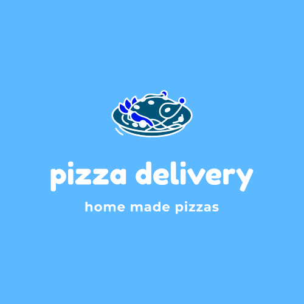

<!-- PROJECT LOGO -->
<br />
<p align="center">
  <a href="https://ibb.co/sC0TMQV">
    
  </a>

  <h3 align="center">Pizaa Delivery app</h3>

  <p align="center">
    <br />
    <!-- <a href="https://fynd-my-movie.herokuapp.com/movies">View Demo</a> -->
    <!-- · -->
    <a href="https://github.com/codeWithNithin/">Report Bug</a>
    ·
    <a href="https://github.com/codeWithNithin/">Request Feature</a>
  </p>
</p>


<!-- TABLE OF CONTENTS -->
## Table of Contents

* [About the Project](#about-the-project)
* [Getting Started](#getting-started)
  * [Installation](#installation)


<!-- ABOUT THE PROJECT -->
## About The Project

Will be updating this soon


<!-- GETTING STARTED -->
## Getting Started

To get a local copy up and running follow these simple example steps.

### Installation

1. Clone the repo
```sh
git clone https://github.com/codeWithNithin/mern-pizza-app
```
3. Install all dependencies
```sh
 npm i
```
3. Add configurations as shown in .env.example file.

4. Run the application
```sh
npm run dev
```

<!-- LICENSE -->
## License

Distributed under the MIT License. See `LICENSE` for more information.
